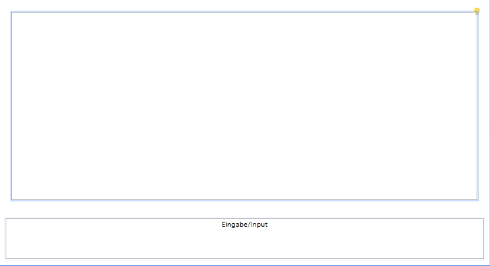

# Projekt: Song_Texte

**Autor:** Vanessa Schmelzer

## Kurzbeschreibung

Das Programm schreibt mithilfe von Chat GPT Song Texte im Stil eines jeweiligen Enterpreneuers mit Angabe eines Themas

## Nutzung des Programms

Um das Programm zu verwenden, folgen Sie bitte den untenstehenden Anweisungen:

1. **Installation:**
   - Klonen Sie das Repository auf Ihren lokalen Computer.

2. **Ausführung:**
   - Öffnen Sie eine Terminal- oder Befehlszeilen-Schnittstelle.
   - Navigieren Sie zum Verzeichnis, in dem sich das Programm befindet.
   - Führen Sie die Hauptdatei aus `SongTexte.sln`.

3. **Interaktion:**
   - Geben Sie Ihren Enterpeneur und Thema in das Eingabefeld ein.
   - Drücken Sie die Eingabetaste , um die Anfrage an das ChatGPT-Modell zu senden.
   - Lesen Sie die Antwort des Modells und interagieren Sie bei Bedarf weiter.

## Screenshots

### Startansicht

### Beispiel-Chatverlauf

